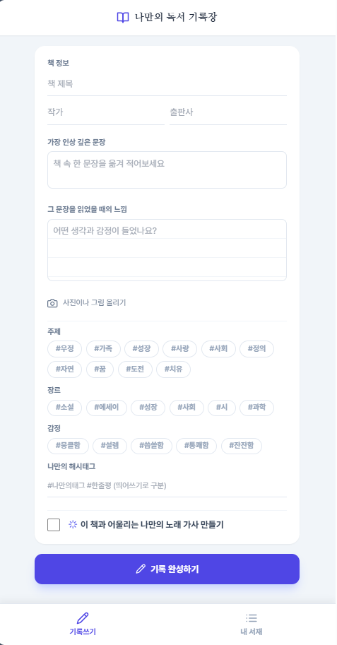

# 📖 나만의 독서 기록장 (Reading Diary)

책을 읽고 인상 깊었던 문장과 그때의 감정을 기록하는 웹 앱입니다.
읽은 책을 태그와 함께 정리하고, 원하면 그 책과 어울리는 나만의 노래 가사도 자동으로 만들어줍니다.

## ✨ 주요 기능

- **독서 기록 작성**: 책 제목, 작가, 출판사 정보와 함께 인상 깊은 문장, 그때의 느낌을 기록
- **사진 첨부**: 책 사진이나 그림을 함께 남기기
- **태그 분류**: 주제(우정, 성장, 사랑 등), 장르, 감정 태그 + 나만의 자유 해시태그
- **가사 자동 생성**: 선택한 장르/감정 태그를 바탕으로 그 책과 어울리는 노래 가사를 자동 생성
- **내 서재**: 작성한 기록을 브라우저에 저장하고 목록으로 확인·삭제
- **이미지로 저장**: 완성된 기록 카드를 이미지 파일로 다운로드
- **PWA 지원**: 홈 화면에 앱처럼 추가해서 사용 가능

## 📸 스크린샷

<!--  -->
